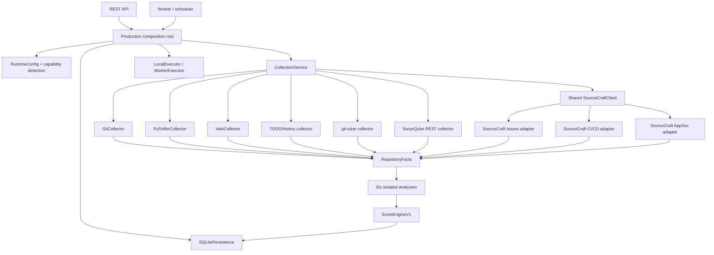

# Runtime Dependency Graph

## Direction rules

- API, worker, and scheduler depend on the composition root, never on provider
  internals.
- External providers depend on `SourceCraftClient` or process/HTTP boundaries;
  they do not depend on FastAPI, persistence, or analyzers.
- Providers emit only normalized `RepositoryFacts`.
- Analyzers consume contracts and policy modules; no analyzer imports another
  analyzer's internals.
- Score Engine v1 consumes category results and remains unchanged.
- Persistence stores result contracts only; credentials and raw provider
  payloads are excluded.

## Boundary risk

The only current runtime substitution is the explicit unavailable Issues/CI/CD
placeholder in `runtime.py`. Replacing it with official adapters is therefore
low-risk if the provider-to-facts mapping is contract-tested and the existing
golden analyzer tests remain unchanged.
