# C4 Component View: Analysis contracts

Research: [INDEX.md](INDEX.md)
Parent container: [C4-CONTAINER.md](C4-CONTAINER.md)

## Diagram

```mermaid
flowchart LR
    request["Component: AnalysisRequest"] -->|profile + safe auth context| collection["Component: CollectionService"]
    collection -->|normalized profile/capabilities| facts["Component: RepositoryFacts"]
    facts -->|facts + profile| analyzer["Component: AnalyzerInput"]
    analyzer -->|scan-aware result| category["Component: CategoryResult"]
    category -->|six categories| score["Component: ScoreInput / ScoreEngineV1"]
    score -->|context-preserving score| result["Component: RepoHealthResult"]
```

## Components

| Component | Responsibility | Interface / data | Evidence |
|-----------|----------------|-----------------|----------|
| AnalysisRequest | Select repository, time, profile, and safe authorization metadata | Pydantic versioned contract | `src/repo_health/contracts/requests.py` |
| CollectionService | Apply profile eligibility and merge source statuses | `CollectionContext` → `RepositoryFacts` | `src/repo_health/collection/service.py` |
| RepositoryFacts | Own normalized facts, profile, used sources, provider capability states | redacted serializable model | `src/repo_health/contracts/results.py` |
| AnalyzerInput | Transport-neutral per-analyzer input | profile + facts + digest | `src/repo_health/contracts/results.py` |
| CategoryResult | Preserve score/null, coverage, confidence, evidence, limitations, and profile | analyzer output contract | `src/repo_health/contracts/results.py` |
| AppSec SecurityFacts | Preserve typed scan lifecycle state and numeric finding observations | `SecurityFacts` | SourceCraft AppSec adapter |
| ScoreInput / ScoreEngineV1 | Feed one unchanged formula while retaining context | six CategoryResult slots + metadata | `src/repo_health/scoring/v1.py` |
| RepoHealthResult | Public result with score and observation context | profile + sources + capabilities + breakdown | `src/repo_health/contracts/results.py` |

## Relationships and Constraints

| From | To | Contract | Constraint / risk | Evidence |
|------|----|----------|------------------|----------|
| AnalysisRequest | CollectionService | `assessment_profile` | PUBLIC must not call owner-authorized SourceCraft collectors | supplied hardening specification |
| RepositoryFacts | AnalyzerInput | `assessment_profile`, `used_sources`, `capability_states` | no credentials or raw provider payloads | project rules |
| SecurityFacts | SecurityAnalyzer | `scan_state` plus scalar findings | NO_SCAN/FAILED/UNAVAILABLE cannot become numeric score | supplied hardening specification |
| AnalyzerInput | CategoryResult | profile and source context | API/worker serialized execution must match | existing process isolation tests |
| CategoryResult | ScoreEngineV1 | existing score slots plus metadata | do not branch formulas by profile | frozen scoring invariant |
| ScoreEngineV1 | RepoHealthResult | context metadata | same numeric score retains observation context | supplied hardening specification |
| PyDriller | ActivityAnalyzer | existing author count plus identity policy facts | no aggressive email/name merge | supplied hardening specification |
