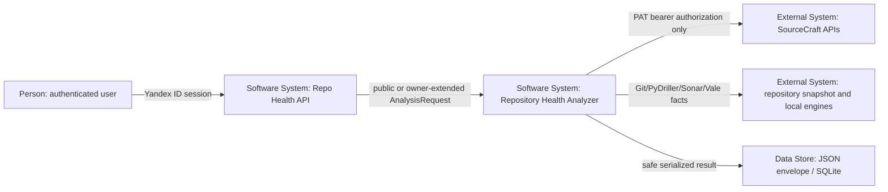

# C4 System Context: Pre-main production hardening

Research: [INDEX.md](INDEX.md)
Scope: Repository Health Analyzer assessment context and trust boundaries

## Diagram

## Elements

| Element | Type | Responsibility | Evidence |
|---------|------|----------------|----------|
| Authenticated user | Person | Owns Yandex ID session and may provide repository selection/authorization | supplied hardening specification |
| Repo Health API | Software system | Accepts typed analysis requests and exposes results; must not treat PAT as identity | `src/repo_health/api/app.py` |
| Repository Health Analyzer | Software system | Collects normalized facts, executes six analyzers, and applies one ScoreEngineV1 | `.ai-factory/ARCHITECTURE.md`, `src/repo_health/orchestration/orchestrator.py` |
| SourceCraft APIs | External system | Provides owner-authorized Issues, CI/CD, and AppSec facts through PAT bearer transport | `src/repo_health/collection/sourcecraft.py` |
| Repository snapshot/local engines | External system | Provides public Git-derived facts and optional Vale/Sonar/git-sizer evidence | `src/repo_health/collection/git`, `src/repo_health/collection/code_health` |
| JSON envelope / SQLite | Data store | Persists redacted versioned contracts, never credential values | `src/repo_health/persistence/sqlite.py` |

## Relationships

| From | To | Interaction / data | Protocol / frequency | Evidence |
|------|----|--------------------|----------------------|----------|
| Authenticated user | Repo Health API | Yandex identity/session and repository selection | HTTPS request | supplied hardening specification; current API boundary |
| API | Analyzer | `AnalysisRequest` with `assessment_profile` and safe authorization metadata | typed JSON / local call | `src/repo_health/contracts/requests.py` |
| Analyzer | SourceCraft APIs | PAT-authenticated provider request for OWNER_EXTENDED only | REST per analysis | `src/repo_health/collection/sourcecraft.py` |
| Analyzer | snapshot/local engines | Git/PyDriller and optional process adapters | local process/library per analysis | collector modules |
| Analyzer | SQLite | `AnalysisEnvelope`, facts, results, and task state | serialized JSON | `src/repo_health/persistence/sqlite.py` |

## Boundary Notes

- Yandex ID identifies the user of this service; it is not a SourceCraft API credential.
- SourceCraft PAT authorizes provider calls for a repository and scope; its value never crosses the contract/persistence/logging boundary.
- PUBLIC assessment excludes owner-authorized SourceCraft facts and remains valid without a PAT.
- OWNER_EXTENDED is a request context, not a second scoring formula or a second analyzer graph.
- Repository contents and provider responses are untrusted inputs; adapters normalize and redact before facts are persisted.
