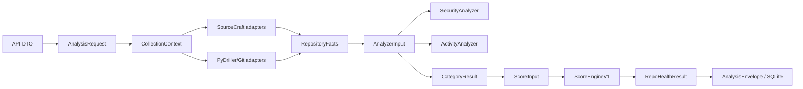

# Dependency Graph: Pre-main production hardening

Research: [INDEX.md](INDEX.md)

## Graph

## Edges

| From | To | Type | Why required | Risk / change impact | Evidence |
|------|----|------|--------------|----------------------|----------|
| API DTO | AnalysisRequest | validation | profile and safe auth context must enter once | API/worker drift | `src/repo_health/api/app.py` |
| AnalysisRequest | CollectionContext | runtime input | collection eligibility depends on profile | owner facts leaking into PUBLIC | `src/repo_health/collection/ports.py` |
| Collection adapters | RepositoryFacts | normalization | raw SourceCraft/Git data must stop at adapter | secret/payload leakage | collector modules |
| RepositoryFacts | AnalyzerInput | serialized boundary | local/worker parity | digest and metadata drift | `src/repo_health/analyzers/base.py` |
| SecurityFacts | SecurityAnalyzer | policy input | scan lifecycle controls numeric eligibility | failed/no-scan score fabrication | AppSec collector/analyzer |
| PyDriller | ActivityAnalyzer | policy input | preserve formula while exposing identity uncertainty | contributor double counting | PyDriller collector/analyzer |
| CategoryResult | ScoreEngineV1 | aggregation | one canonical score path | duplicate formula by profile | `src/repo_health/scoring/v1.py` |
| RepoHealthResult | Persistence | immutable JSON | context survives API/worker/replay | public/owner score ambiguity | persistence layer |

## Findings

- Critical path: profile and safe authorization metadata must be established before collection and copied into every result boundary.
- The SourceCraft PAT boundary is only in `SourceCraftClient`; no analyzer or contract should receive the credential value.
- AppSec currently has a real three-stage chain but lacks a typed scan lifecycle, so empty/failed/unavailable paths are observationally ambiguous.
- PyDriller currently counts normalized author names and does not persist emails; adding ambiguity facts is safer than guessing identity merges or changing the frozen formula.
- The JSON envelope means new metadata can be added without a SQL schema migration, provided old payloads receive defaults during Pydantic validation.
