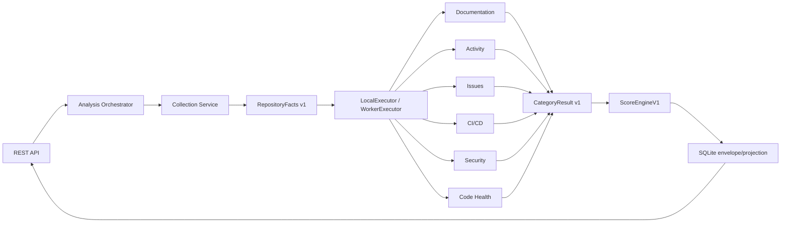

# Target architecture

The product is a backend-only SourceCraft Repository Health Analyzer. The
current deployment is one API process with a pluggable local or durable worker
executor; the contracts are ready for separate services without moving scoring
or analyzer business logic.

Dependency direction is one-way: API → orchestration → execution/collection →
contracts and analyzers; scoring consumes contracts only; persistence stores
contracts only. Analyzer packages do not import FastAPI, persistence or each
other. Raw SourceCraft responses stop at adapters and are normalized into
bounded scalar facts.

The deployable boundaries are API, orchestrator, collector, analyzer worker and
score engine. Six network services are intentionally not required for the
local/hackathon deployment.

## Assessment and authorization context

Every request carries a typed `AssessmentProfile`:

- `PUBLIC` is the default. It uses public/Git-derived evidence and does not
  consume owner-authorized SourceCraft Issues, CI/CD or AppSec facts, even when
  a server-side PAT is configured.
- `OWNER_EXTENDED` uses the same six analyzers and the same ScoreEngineV1, but
  may include SourceCraft owner data. It requires a trusted Yandex ID subject
  and an `AUTHORIZED` SourceCraft access state in the request context.

Yandex ID identifies the service user; a SourceCraft PAT is only a server-side
transport credential. Neither token value is a contract field, persisted value,
log field or error message. The current API accepts no arbitrary identity claim;
trusted identity injection remains an upstream authentication responsibility.

Profile, safe capability states and used-source IDs flow through
`AnalysisRequest`, `RepositoryFacts`, `AnalyzerInput`, `CategoryResult`,
`ScoreInput`, `RepoHealthResult` and the persisted envelope. This makes API and
Worker execution auditable without changing scoring arithmetic.
